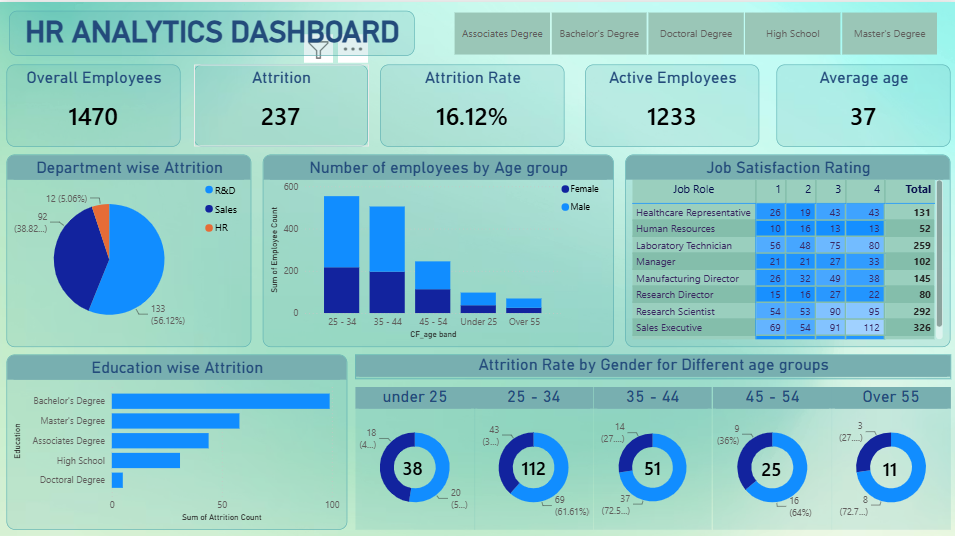

# HR Analytics Dashboard | Power BI

## Project Overview

This HR Analytics Dashboard was developed using Power BI to analyze employee attrition, workforce demographics, education trends, age distribution, and job satisfaction levels. The dashboard helps HR teams identify key factors contributing to employee turnover and supports data-driven workforce planning.

---

## Dashboard Screenshot

---

## Key Metrics

| KPI | Value |
|------|------|
| Total Employees | 1470 |
| Active Employees | 1233 |
| Attrition Count | 237 |
| Attrition Rate | 16.12% |
| Average Age | 37 |

---

## Dashboard Features

### Employee Overview
- Total Employees
- Active Employees
- Attrition Count
- Attrition Rate
- Average Employee Age

### Attrition Analysis
- Department-wise Attrition
- Education-wise Attrition
- Gender-wise Attrition
- Age Group Attrition Analysis

### Workforce Analysis
- Employee Distribution by Age Group
- Education-Level Filters
- Job Satisfaction Rating Analysis

### Interactive Features
- Dynamic Filters
- Interactive Visualizations
- Drill-down Analysis

---

## Tools & Technologies Used

- Power BI
- Power Query
- DAX
- Data Modeling
- Microsoft Excel

---

## Key Insights

- R&D department recorded the highest employee attrition.
- Employees aged 25–34 represent the largest workforce segment.
- Bachelor's degree holders experienced the highest attrition count.
- Job satisfaction levels vary significantly across job roles.
- Workforce demographics provide valuable insights into retention strategies.

---

## Skills Demonstrated

- Data Cleaning
- Data Transformation
- Data Modeling
- DAX Calculations
- Dashboard Development
- Data Visualization
- HR Analytics
- Business Intelligence
- Insight Generation

---

## Business Impact

This dashboard enables HR professionals to:

- Monitor employee attrition trends.
- Identify high-risk employee segments.
- Evaluate workforce demographics.
- Improve employee retention strategies.
- Support data-driven decision-making.

---

## Project Files

- HR_Analytics_Dashboard.pbix
- HR_Data.xlsx
- Dashboard_Screenshot.png
- README.md

---

## Author

**Priyansh Agarwal**

Aspiring Data Analyst passionate about transforming raw data into actionable business insights using Power BI, SQL, Excel, and Python.

### Connect With Me

LinkedIn: www.linkedin.com/in/priyansh-agarwal447

GitHub: https://github.com/Priyansh9112004
